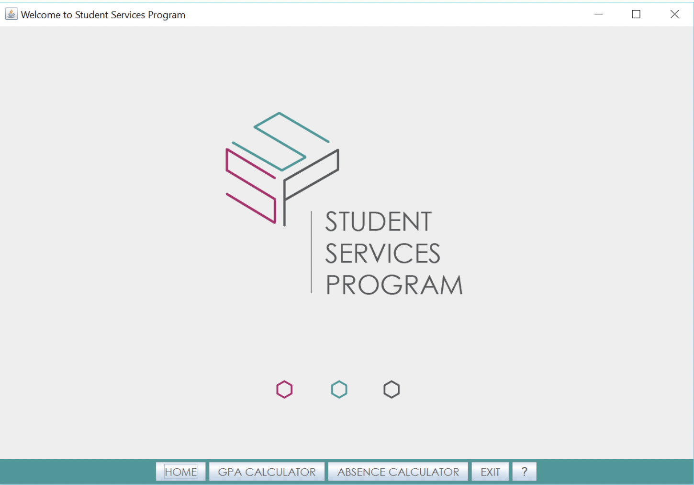
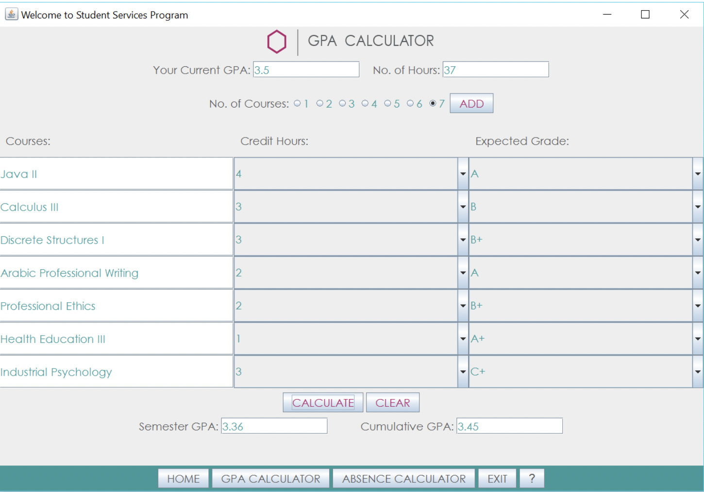
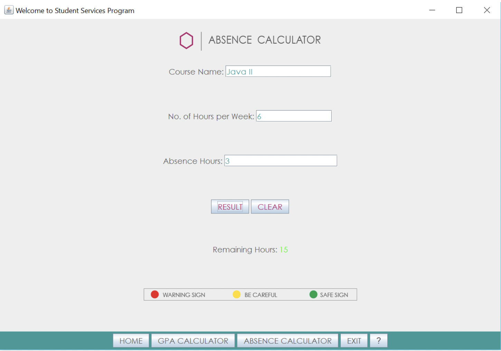

# Student Service Program

## Project Overview

A **Student Services Program (SSP)** serves students to predict semester and cumulative GPA,
as well as calculating remaining hours to avoid getting a DN in a course. 
This program is compatible with rules of Jubail University College.

## How to Use the SSP
 
 
 
 
### Home Page

The homepage of **SSP** shows program's logo and its main buttons which include:
- Home
- GPA Calculator
- Absence Calculator
- Exit
- ?

### GPA Calculator

Predicting the semester and cumulative GPA requires the student to provide the program with the following data:

- Current GPA
- Number of hours of all courses taken in all previous semesters (e.g. 22 hours)
- Number of courses taken in the current semester
- Courses’ names (Optional), credit hours, and expected grade

Then the student would click **“Calculate”** to show the expected semester and cumulative GPA.

### Absence Calculator

Calculating the remaining hours before getting a DN in a course requires the student to provide the program with the following data:

- Course name (Optional)
- Number of hours per week for that course (e.g. 6 hours)
- Absence hours in that course

After that the student would click **“Result”** to show the remaining hours in that course before getting DN.

## References
- Savitch W., (2013), Absolute Java (5th ed.). San Diego, CA: University of California.
- https://www.javatpoint.com/java-tutorial
- http://www.qu.edu.sa/GPA.aspx
- http://www.ucj.edu.sa/en/eservices/Pages/GPA-Calculation.aspx

## Developed By:
- Reem AlWadaey
- Muntaha AlShahrani
- Atheer AlHawaidi

